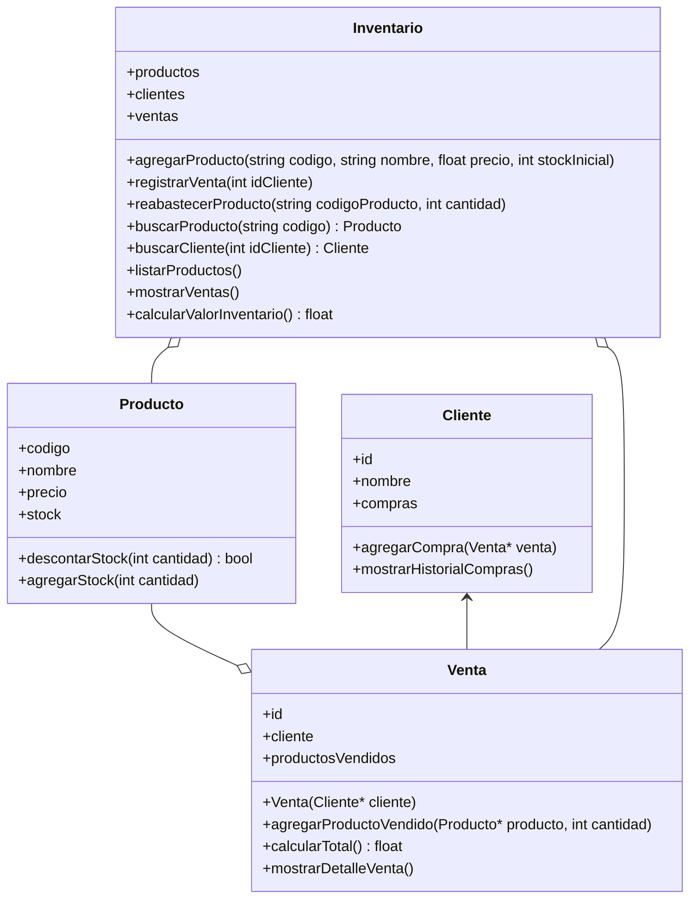

## DIAGRAMA EN MERMAID CHART

```mermaid
classDiagram

    class Producto {
	    +codigo
	    +nombre
	    +precio
	    +stock
	    +descontarStock(int cantidad) bool
	    +agregarStock(int cantidad)
    }

    class Cliente {
	    +id
	    +nombre
	    +compras
	    +agregarCompra(Venta* venta)
	    +mostrarHistorialCompras()
    }

    class Venta {
	    +id
	    +cliente
	    +productosVendidos
	    +Venta(Cliente* cliente)
	    +agregarProductoVendido(Producto* producto, int cantidad)
	    +calcularTotal() float
	    +mostrarDetalleVenta()
    }

    class Inventario {
	    +productos
	    +clientes
	    +ventas
	    +agregarProducto(string codigo, string nombre, float precio, int stockInicial)
	    +registrarVenta(int idCliente)
	    +reabastecerProducto(string codigoProducto, int cantidad)
	    +buscarProducto(string codigo) Producto
	    +buscarCliente(int idCliente) Cliente
	    +listarProductos()
	    +mostrarVentas()
	    +calcularValorInventario() float
    }

    Producto --o Venta
    Cliente <-- Venta
    Inventario o-- Producto
    Inventario o-- Venta


```