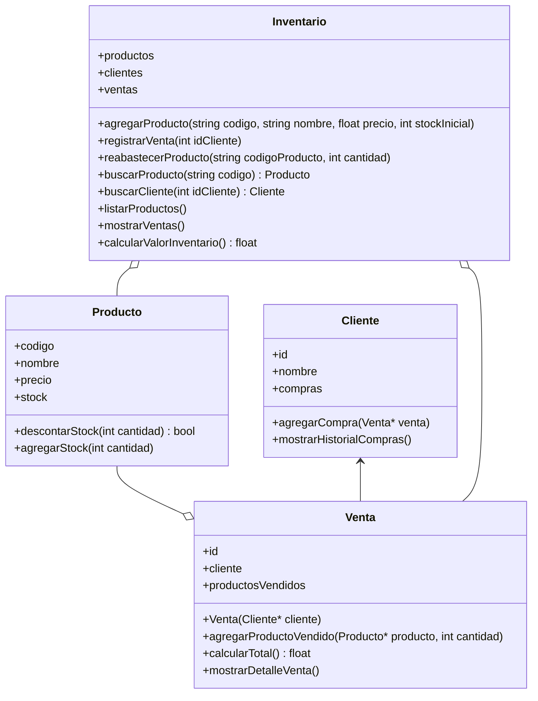
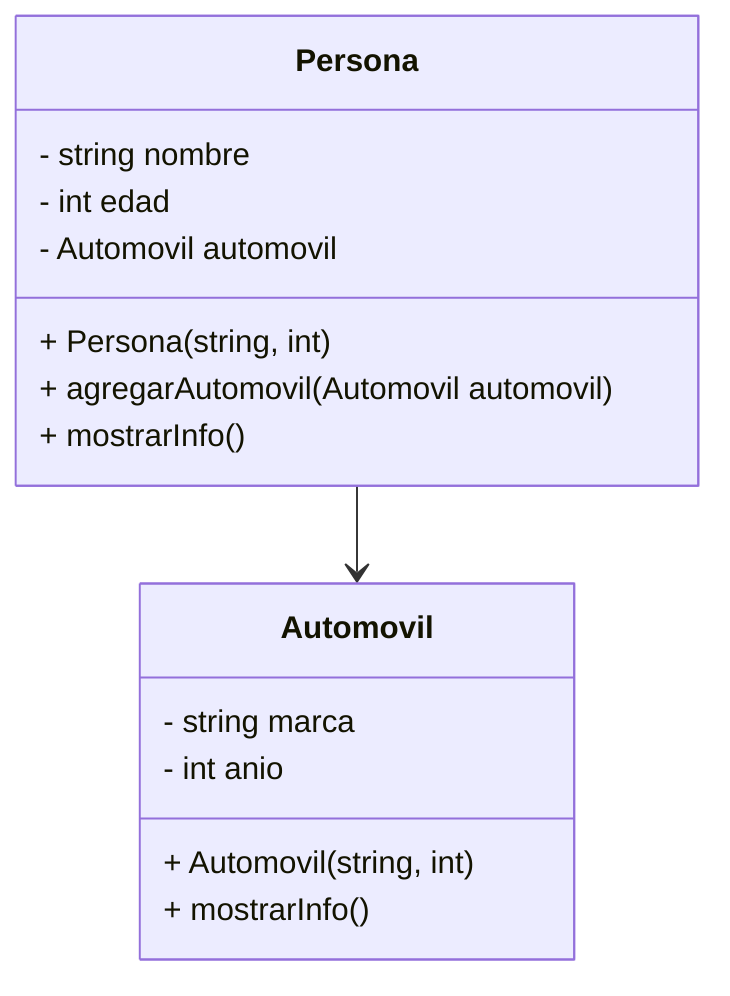

## DIAGRAMA EN MERMAID CHART




##  Ejercicios

Siguiendo el ejemplo disponible en: https://github.com/lufe089/POOEjemploCurso: 

* Haga la codificación de las clases que corresponden a los siguientes diagramas. Puede agregar métodos y funcionalidades si lo desea y hacer ajustes en los 
parametros de los métodos.  **Recuerde crear un proyecto nuevo para cada caso**
* Cree objetos en el main de todos los tipos para probar que su código funciona
* Relacione los objetos entre si, por ejemplo agregue un automóvil a una persona.  

Puede consultar sus dudas sobre cómo hacer la codificación aquí: https://github.com/lufe089/POO/blob/main/3.CodificacionCpp.md

## 📌 Requisitos Previos

Para realizar esta actividad, debes cumplir con los siguientes requisitos previos:

- Tener instalado y configurado correctamente el IDE **CLion**.
- Saber crear, compilar y ejecutar proyectos en CLion.
- Diseño en UML con mermaid
- Tener conocimientos básicos de programación en C++, incluyendo estructuras básicas, funciones
- Abrir el esqueleto de proyecto proporcionado en CLION

---

## 🛠️ **Descripción del sistema**

Actualmente, las pequeñas tiendas han comenzado a adoptar tecnologías digitales para mejorar la gestión de sus productos y reducir el desperdicio. Una tienda de productos ecológicos necesita un sistema que le permita gestionar su inventario, registrar nuevos productos, actualizar cantidades en stock, gestionar ventas a clientes y calcular el valor total del stock disponible.

Este ejercicio permitirá llevarte desde el diseño orientado a objetos hasta su implementación en código C++.

Antes de iniciar la implementación, es importante realizar un análisis del problema para identificar claramente qué entidades (clases) se requieren, qué atributos tendrán estas entidades y qué funcionalidades específicas deberán implementar.

Como guía inicial, considera que el sistema debe permitir:

- Registrar nuevos productos, identificados por un código único, nombre, precio y cantidad inicial.
- Gestionar clientes que pueden realizar compras y llevar un historial de estas.
- Registrar ventas a clientes, indicando claramente los productos y cantidades compradas.
- Actualizar el inventario en función de las ventas y de la llegada de nuevos productos.
- Calcular y mostrar el valor total del inventario en cualquier momento.

## 📌 **Tareas iniciales para estudiantes:**

- Identificar y describir las clases principales involucradas en el problema.
- Determinar qué atributos y métodos deberá tener cada clase.
- Realizar un diagrama de clases que represente la estructura y relaciones del sistema.

Una vez realizado este análisis, podrás revisar y comparar con la propuesta sugerida más adelante.

## 📚 Apoyo y acompañamiento

La profesora estará disponible durante las sesiones de clase y mediante citas agendadas posteriormente para resolver dudas puntuales y guiar el proceso de aprendizaje y desarrollo del proyecto.

## 🎯 Entregas y cronograma

- **Día 1 de clase:**
  - Diagrama UML usando mermaid.
  - Archivos `.h` y `.cpp` iniciales de todas las clases.
  - Dos métodos funcionando correctamente.

- **Día 2 de clase:**
  - Al menos cinco métodos funcionando correctamente.

- **Domingo (entrega final):**
  - Proyecto completo funcionando, compilando sin errores y con todas las funcionalidades implementadas.

Además, deberán crear un método en la clase `Tienda` que permita inicializar objetos directamente, similar al método usado en el ejemplo de las "torres de Niza".


---
## 📝 Propuesta base de Solución (para revisión posterior al análisis inicial)
> Puede agregar más métodos según sea necesario
### 🔸 Clase Producto
- **Atributos:** `codigo`, `nombre`, `precio`, `stock`
- **Métodos:**
  - `bool descontarStock(int cantidad)`: Descuenta del stock la cantidad indicada si hay suficientes unidades disponibles. Retorna verdadero (`true`) si la operación es exitosa, falso (`false`) en caso contrario.
  - `void agregarStock(int cantidad)`: Incrementa el stock del producto en la cantidad indicada.

### 🔸 Clase Cliente
- **Atributos:** `id`, `nombre`, `compras`
- **Métodos:**
  - `void agregarCompra(Venta* venta)`: Guarda un apuntador a una nueva venta realizada por el cliente en su historial.
  - `void mostrarHistorialCompras()`: Imprime por pantalla todas las ventas registradas en el historial del cliente, mostrando los detalles de cada compra.

### 🔸 Clase Venta

- **Atributos:** `id`, `cliente`, `productosVendidos`
- **Constructores y destructores:** Constructor para inicializar atributos, destructor para liberar recursos.
- **Métodos:**
  - `Venta(Cliente* cliente)`: constructor.
  - `void agregarProductoVendido(Producto* producto, int cantidad)`: Agrega un producto y su cantidad a la lista de productos vendidos.
  - `float calcularTotal()`: Retorna el valor total de la venta.
  - `void mostrarDetalleVenta()`: Muestra detalles de la venta.

### 🔸 Clase Tienda (Controladora)

- **Atributos:** `productos`, `clientes`, `ventas`
- **Constructores y destructores:** Constructor para inicializar atributos, destructor para liberar recursos.
- **Métodos:**
  - `void agregarProducto(string codigo, string nombre, float precio, int stockInicial)`: Registra un nuevo producto.
  - `void registrarVenta(int idCliente)`: Registra una nueva venta.
  - `void reabastecerProducto(string codigoProducto, int cantidad)`: Incrementa stock de un producto existente.
  - `Producto* buscarProducto(string codigo)`: Busca producto por código.
  - `Cliente* buscarCliente(int idCliente)`: Busca cliente por ID.
  - `void listarProductos()`: Lista productos disponibles.
  - `void mostrarVentas()`: Muestra resumen de ventas.
  - `float calcularValorInventario()`: Calcula valor total del inventario.

## 🎯 Cronograma y Entregables
- **Día 1:** Diagrama Mermaid, clases básicas (`.h`, `.cpp`), mínimo 2 métodos funcionales.
- **Día 2:** Al menos 5 métodos funcionales.
- **Entrega Final:** Proyecto completo funcional, compilando sin errores, incluyendo todos los métodos y funcionalidades solicitadas. Commits periódicos en repositorio.

**Nota:** Esta actividad se puede realizar en grupos de máximo 2 personas.

## 🚩 Requisitos Técnicos del Proyecto

- Las declaraciones e implementaciones deben estar separadas en archivos `.h` y `.cpp`.
- Es obligatorio utilizar contenedores tipo `vector` para gestionar las colecciones.
- Apuntadores para la creación y manejo dinámico de objetos.
- Cada clase debe tener constructores y destructores claramente definidos. Recuerden que todas las clases deben tener constructores sin parámetros
- La aplicación principal debe desarrollarse en `main.cpp` con un menú interactivo para usar todas las funcionalidades disponibles. Toma de ejemplo el del ejercicio de las torres de Niza disponible en: https://github.com/lufe089/ejm_mem_dinamica_obj

## 🎯 Entregables de los Estudiantes

- Diagrama de clases  en Mermaid mostrando relaciones, atributos y métodos.
- Archivos `.h` y `.cpp` claramente organizados en carpetas.
- Un archivo `main.cpp` que permita interactuar con el sistema mediante un menú claro y funcional.
- Proyecto funcionando correctamente y compilando sin errores, incluyendo cada una de las funcionalidades solicitadas.
- Commits periódicos mostrando el avance del proyecto en un repositorio.

    -----------------------------------------------------------------------------------------------

    ### Ejercicio 1 Persona y automóvil



    -----------------------------------------------------------------------------------------------


```mermaid
title Diagrama de Clases - Inventario y Ventas
classDiagram
direction TB
    class Producto {
        +codigo
        +nombre
        +precio
        +stock
        +descontarStock(int cantidad) bool
        +agregarStock(int cantidad)
    }

    class Cliente {
        +id
        +nombre
        +compras
        +agregarCompra(Venta* venta)
        +mostrarHistorialCompras()
    }

    class Venta {
        +id
        +cliente
        +productosVendidos
        +Venta(Cliente* cliente)
        +agregarProductoVendido(Producto* producto, int cantidad)
        +calcularTotal() float
        +mostrarDetalleVenta()
    }

    class Inventario {
        +productos
        +clientes
        +ventas
        +agregarProducto(string codigo, string nombre, float precio, int stockInicial)
        +registrarVenta(int idCliente)
        +reabastecerProducto(string codigoProducto, int cantidad)
        +buscarProducto(string codigo) Producto
        +buscarCliente(int idCliente) Cliente
        +listarProductos()
        +mostrarVentas()
        +calcularValorInventario() float
    }

    Producto --o Venta
    Cliente <-- Venta
    Inventario o-- Producto
    Inventario o-- Venta


