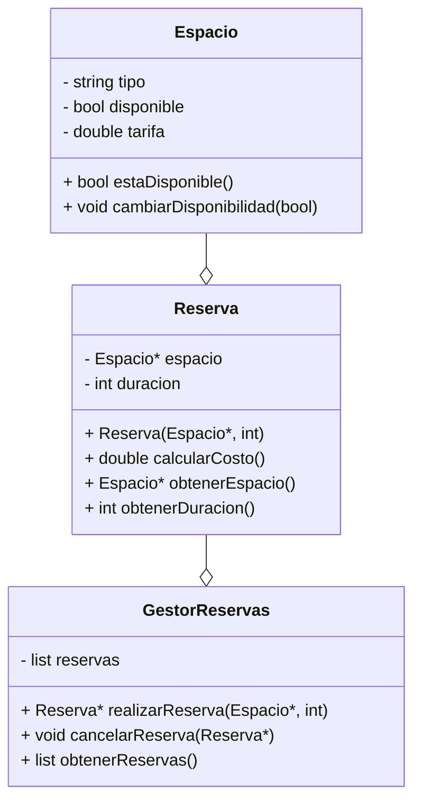
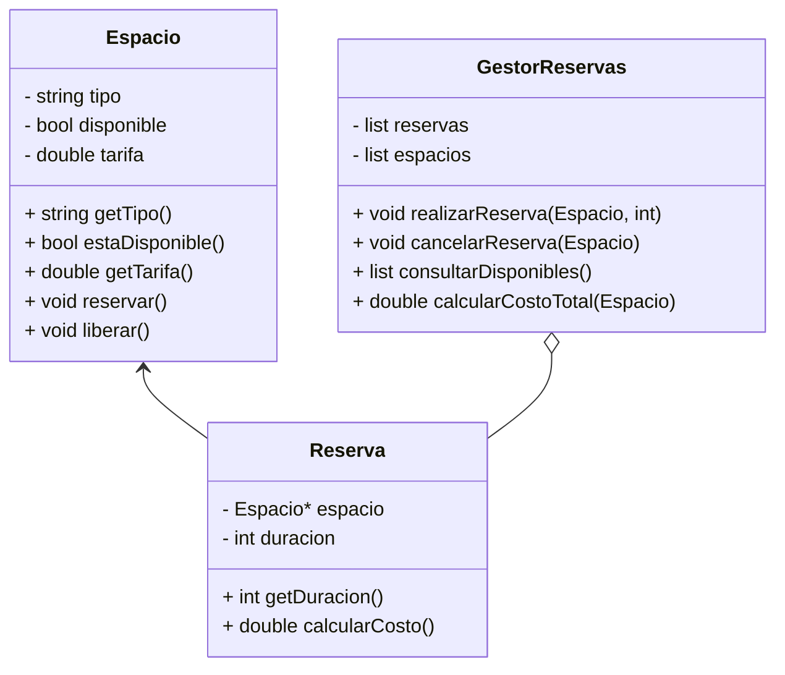
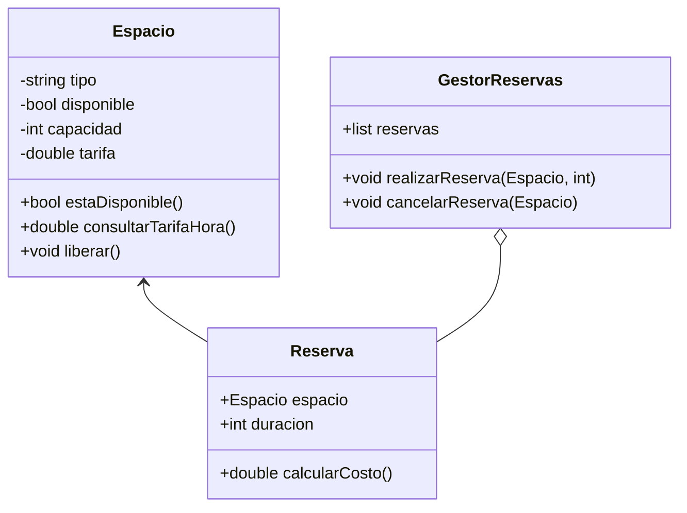
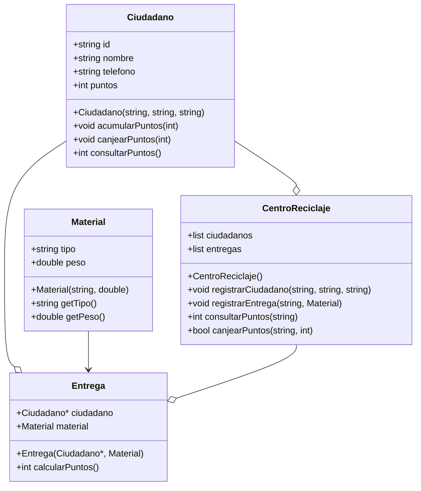

### Grupo
Santiago Vasco Lasso
Alfonso Vega Villadiego
Alan Orlando Mendez Ospina

### Punto A

##### Diseño uno

```mermaid
classDiagram
    class Espacio {
        - string tipo
        - bool disponible
        - double tarifa
        
        + bool estaDisponible()
        + void cambiarDisponibilidad(bool)
    }

    class Reserva {
        - Espacio* espacio
        - int duracion

        + Reserva(Espacio*, int)
        + double calcularCosto()
        + Espacio* obtenerEspacio()
        + int obtenerDuracion()
    }

    class GestorReservas {
        - list<Reserva> reservas

        + Reserva* realizarReserva(Espacio*, int)
        + void cancelarReserva(Reserva*)
        + list<Reserva> obtenerReservas()
    }

    Espacio --o Reserva
    Reserva --o GestorReservas
```

##### Diseño dos

```mermaid
classDiagram
    class Espacio {
        - string tipo
        - bool disponible
        - double tarifa

        + string getTipo()
        + bool estaDisponible()
        + double getTarifa()
        + void reservar()
        + void liberar()
    }

    class Reserva {
        - Espacio* espacio
        - int duracion

        + int getDuracion()
        + double calcularCosto()
    }

    class GestorReservas {
        - list reservas
        - list espacios

        + void realizarReserva(Espacio, int) 
        + void cancelarReserva(Espacio) 
        + list consultarDisponibles()  
        + double calcularCostoTotal(Espacio) 
    }

    Espacio <-- Reserva
    GestorReservas o-- Reserva
```

##### Diseño tres

```mermaid
classDiagram
    class Espacio {
        -string tipo
        -bool disponible
        -int capacidad
        -double tarifa
        +bool estaDisponible()
        +double consultarTarifaHora()
        +void liberar()
    }

    class Reserva {
        +Espacio espacio
        +int duracion
        +double calcularCosto()
    }

    class GestorReservas {
        +list<Reserva> reservas
        +void realizarReserva(Espacio, int)
        +void cancelarReserva(Espacio)
    }

    Espacio <-- Reserva
    GestorReservas o-- Reserva
```

### Punto B

```mermaid
classDiagram
direction TB
    class Material {
	    +string tipo
	    +double peso
	    +Material(string, double)
	    +string getTipo()
	    +double getPeso()
    }

    class Entrega {
	    +Ciudadano* ciudadano
	    +Material material
	    +Entrega(Ciudadano*, Material)
	    +int calcularPuntos()
    }

    class CentroReciclaje {
	    +list ciudadanos
	    +list entregas
	    +CentroReciclaje()
	    +void registrarCiudadano(string, string, string)
	    +void registrarEntrega(string, Material)
	    +int consultarPuntos(string)
	    +bool canjearPuntos(string, int)
    }

    class Ciudadano {
	    +string id
	    +string nombre
	    +string telefono
	    +int puntos
	    +Ciudadano(string, string, string)
	    +void acumularPuntos(int)
	    +void canjearPuntos(int)
	    +int consultarPuntos()
    }

    Ciudadano --o Entrega
    Ciudadano --o CentroReciclaje
    Material --> Entrega
    CentroReciclaje --o Entrega
```